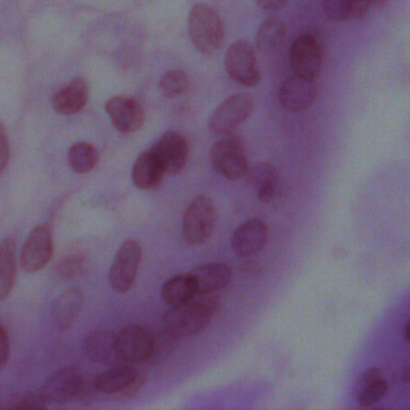
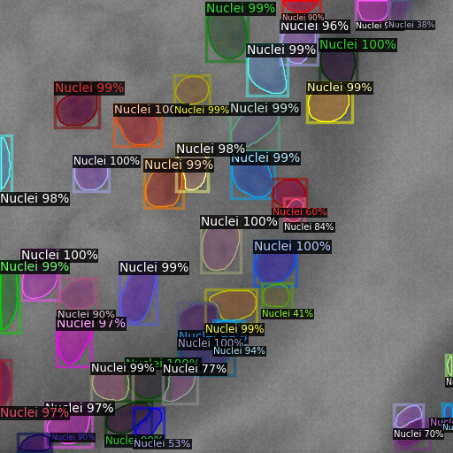
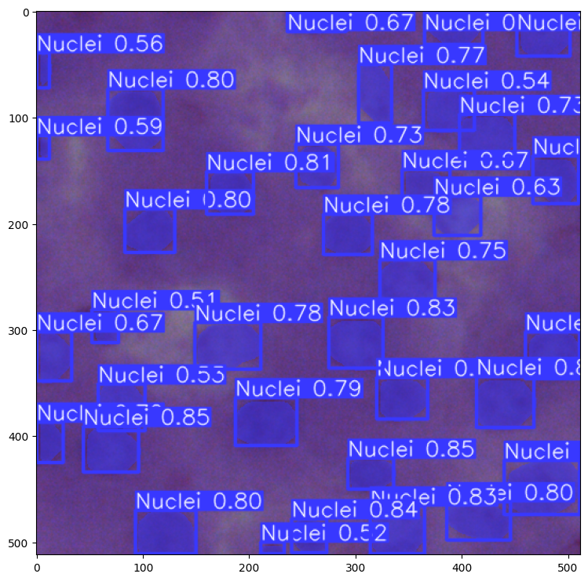

# Nuclei Instance Segmentation with Detectron2 and YOLOv8

This project provides a comprehensive solution for nuclei instance segmentation, covering a range of tasks from downloading the NuInsSeg dataset to training object detection models and conducting analysis and plotting. The entire workflow is divided into key tasks, each accompanied by downloadable code.
### Key Tasks

1. **Downloading Data from Kaggle**
   
    Retrieve the NuInsSeg dataset from Kaggle using the provided link: [NuInsSeg Dataset](https://www.kaggle.com/datasets/ipateam/nuinsseg?resource=download).

2. **Cleaning Up the Data**
   
   Prepare the dataset for segmentation by cleaning and organizing it for further processing.

3. **Converting Masks to COCO JSON and YOLOv8 Annotations**
   
   Convert segmentation masks into both COCO JSON format and YOLOv8 annotations to facilitate compatibility with different object detection frameworks.

4. **Visualizing Annotations**
   
    Develop visualization tools to better understand and verify the annotated data.

5. **Training Detectron2 (Mask R-CNN) for Object Detection**
   
    Implement and train the Mask R-CNN model using the Detectron2 framework for accurate nuclei instance segmentation.

6. **Training YOLOv8 for Object Detection**
   
   Implement and train the YOLOv8 model for efficient and precise nuclei instance detection.

## Demo
### Using Detectron2 (Mask R-CNN)

  

    
Test Image

    
  

  

    
Inference

    
  

### Using YOLOv8

## Additional Resources

- [Dataset Download Link](https://www.kaggle.com/datasets/ipateam/nuinsseg?resource=download)
- [Dataset Description](https://arxiv.org/abs/2308.01760)

- K. He, G. Gkioxari, P. Dollár, and R. Girshick. "Mask R-CNN," 2017 IEEE International Conference on Computer Vision (ICCV), Venice, Italy, 2017, pp. 2980-2988. [DOI: 10.1109/ICCV.2017.322](https://doi.org/10.1109/ICCV.2017.322)

- [Ultralytics Documentation](https://docs.ultralytics.com/)
